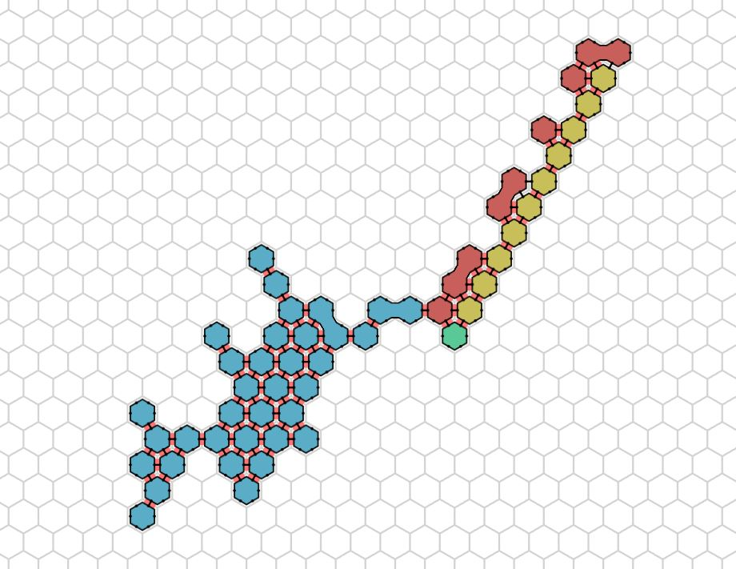

# Amoebot Model

## Amoebot Basics

Amoebots are simple turing complete machines with limited memory and local-only view of their environment, which can communicate with nearby amoebots by the use of beeps. For simplicity, we say that amoebots also can simply send messages to their neighbors. Movements in the system are performed by expansions and contractions on a hexagonal grid, this enables it to implement distributed algorithms which solve tasks like leader election, shape formation or coating. With the newest additions to the model (from 2022), we are now able to form circuits (kind of a broadcast networks) to communicate in larger sets of amoebots. The possibility of bonding to neighboring amoebots enables us to perform joint movements, in which one movement can move whole blocks of other amoebots.

## Model Description

The following more detailed introduction to the Amoebot Model is cited from the paper 'Coordinating Amoebots via Reconfigurable Circuits' by Michael Feldmann, Andreas Padalkin, Christian Scheideler and Shlomi Dolev (2022).

In the geometric amoebot model (Daymude et al., 2021), a set of n amoebots is placed on the infinite regular triangular grid graph G = (V,E). An amoebot is an anonymous, randomized finite state machine that either occupies one or two adjacent nodes of Geqt, and every node of G is occupied by at most one amoebot. If an amoebot occupies just one node, it is called contracted and otherwise expanded, and exactly one of its occupied nodes is called its head. For simplicity, we identify an amoebot by its occupied node(s). Two amoebots that occupy adjacent nodes in G are called neighbors. The set N(u) denotes the neighborhood of amoebot u. Whenever amoebot u is a neighbor of amoebot v, the canonical amoebot model allows u to execute read and write operations on the (public) memory of v. In our reconfigurable circuit extension, we will use a different way of exchanging information, but as we will see, read and write operations can be simulated with this so that our circuit model is indeed an extension of the canonical amoebot model.

An amoebot can move through contractions and expansions. A contracted amoebot occupying node u can expand into an unoccupied adjacent node v. Thereafter, it occupies both, u and v. However, if several amoebots try to expand into the same node at the same time, only one will succeed and the others will remain contracted. We assume these conflicts are arbitrarily resolved, e.g., by a adversary. An expanded amoebot occupying nodes v and w can contract into one of its occupied nodes. Thereafter, it only occupies that node. Additionally, two adjacent amoebots can perform a handover if one is contracted and the other is expanded: Let node u be occupied by the contracted amoebot, and let nodes v and w be occupied by the expanded amoebot such that nodes u and v are adjacent. The contracted amoebot expands into node v while the expanded node contracts into node w.

Each amoebot has a compass orientation (it de nes one of its incident edges as the northern direction) and a chirality (a sense of clockwise or counterclockwise rotation) that it can maintain as it moves, but initially the amoebots might not agree on their compass orientation and chirality. An amoebot can label its incident edges in the order of its sense of chirality in a consecutive fashion starting with 1, where the edge labeled with 1 is the edge to the north whenever it is unique and otherwise the edge of its head pointing to the north.

Let the amoebot structure S (subset of V) be the set of nodes occupied by the amoebots. We say that S is connected if G_S is connected, where G_S = G is the graph induced by S. In this paper, we assume that initially, S is connected and all amoebots are contracted. Also, we assume the fully synchronous activation model, i.e., the time is divided into synchronous rounds, and every amoebot is active in each round. On activation, each amoebot may perform a movement and update its state as a function of its previous state. However, if an amoebot fails to perform its movement, it remains in its previous state. In order to make each state transmission self-initiated, we have to decouple the coordination and execution of a handover from each other as follows. So far, a handover was initiated by one of the two participating amoebots. Now, we require that both amoebots perform the handover separately from each other at the same time, i.e., they have to coordinate the handover beforehand (e.g., by message transmission). Note that the synchronous activation model justifies this adjustment since it allows the amoebots to determine an exact point of time to perform a handover. The time complexity of an algorithm is measured by the number of synchronized rounds required by it.

1. [Circuits](circuits.md)
2. [Joint Movements](jm.md)