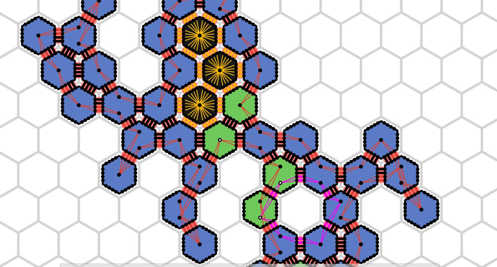

# Amoebot Model

## Reconfigurable Circuits

Here is a short summary what the reconfigurable circuits are about:
Each amoebot has a constant number of pins per side, usually this number is defined per algorithm. Inside the amoebot, multiple pins can be combined in a so-called 'partition set' from which each amoebot can have multiple. Partition sets are disjoint, so one pin can only be a part of one partition set. The pins in each partition set are connected to the partition sets of pins of neighboring particles if they directly connect to another. In this way, multiple partition sets from multiple particles can be connected, they form so-called 'circuits'. Particles can command each partition set to 'beep' once per round, a signal that all circuit-connected particles will receive in their corresponding partition set(s). This way information can be transmitted over greater distances than the local-only neighborhood of each particle.

## Professional Description

In our reconfigurable circuit extension, each edge between two neighboring amoebots u and v is replaced by k edges called external links with endpoints called pins, for some constant k >= 1 that is the same for all amoebots. For each of these links, one pin is owned by u while the other pin is owned by v. We assume that the k pins on the side of u resp. v are consecutively numbered from 1 to k, and there are two possible ways by which these pins are matched (i.e., belong to the same link). If u and v have the same chirality, pin i of u is matched with pin k - i + 1 of v, and if u and v have different chiralities, pin i of u is matched with pin i of v.

Each amoebot u partitions its pin set P(u) into a collection Q(u) of pairwise disjoint subsets such that the union equals the pin set, i.e., P(u) = the union of all Q in Q(u). Note that in contrast to standard literature, we allow empty sets in the partition. We call Q(u) the pin configuration of u and Q in Q(u) a partition set of u. Let Q = 'the union of all Q(u) for all u in S' be the collection of all partition sets in the system. Two partition sets are connected if there is at least one external link between those sets. Let L be the set of all connections between the partition sets in the system. Then, we call H = (Q,L) the pin configuration of the system and any connected component C of H a circuit. Note that if each partition set of Q is a singleton, i.e., a set with exactly one element, then every circuit of H just connects two neighboring amoebots. However, an external link between the neighboring amoebots u and v can only be maintained as long as both, u and v occupy the incident nodes. If either amoebot leaves the respective node, the external link and its pins are removed from the system. An amoebot is part of a circuit if the circuit contains at least one of its pins. A priori, an amoebot u may not know whether two of its partition sets belong to the same circuit or not since initially it only knows Q(u).

Each amoebot u can send a primitive signal (a beep) via any of its partition sets Q in Q(u) that is received by all partition sets of the circuit containing Q. The amoebots are able to distinguish between beeps arriving at different partition sets. More specifically, an amoebot receives a beep at partition set Q if at least one amoebot sends a beep on the circuit belonging to Q, but the amoebots neither know the origin of the signal nor the number of origins. We have chosen a primitive signal instead of more complex messages to keep our extension as simple as possible. Also, we do not have to worry about interference issues in this case. However, beeps are enough to send whole messages over time. We modify an activation of an amoebot as follows. As a function of its previous state and the beeps received in the previous round, each amoebot may perform a movement, update its state, reconfigure its pin configuration, and activate an arbitrary number of its partition sets. The beeps are propagated on the updated pin configurations. If an amoebot fails to perform its movement, it remains in its previous state and pin configuration, and does not beep on any of its partition sets.

(by 'Coordinating Amoebots via Reconfigurable Circuits' by Michael Feldmann, Andreas Padalkin, Christian Scheideler and Shlomi Dolev., 2022)