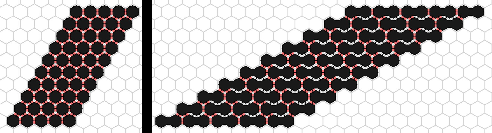

# Amoebot Model

## Joint Movements

In the original amoebot model, expansions and contractions could only happen into empty space resp. left an empty node. One exception was the common 'handover', where one contracted particle expanded into one expanded particle, forcing it to contract. Still, these handovers were not different from contraction and expansion in two consecutive rounds. With the joint movement extension, we can define a connection between two amoebots as a 'bond', marking it as more or less static. This way, the amoebot can be able to expand or contract into some direction and push or pull the connected structure into the direction of its own movement.

## Professional Description

(cite paper here)