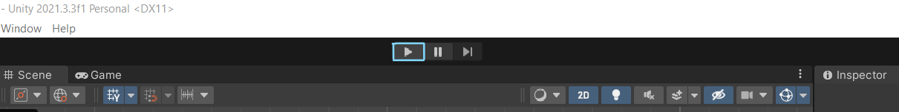

# Installation Guide

## Simulator Setup

After [installing Unity](unity.md), you can setup the simulator project.

### 1. Import the Project

- Clone the repository (https://github.com/martmannupb/AmoebotSim-2.0) into a new folder
	- **Using the command line:**
		- Run `git clone https://github.com/martmannupb/AmoebotSim-2.0`
		- If you get the error message `warning: remote HEAD refers to nonexistent ref, unable to checkout.` or the repository is empty:
			- Navigate into the cloned repository (this may now only contain the `.git/` directory)
			- Run `git checkout master`
			- Now, the repository should be set up correctly (it should contain at least the `AmoebotSim 2.0/` directory)
	- **Using Visual Studio:**
		- Open a new instance of Visual Studio and select "Clone a repository"
			
		- Enter the link `https://github.com/martmannupb/AmoebotSim-2.0` and choose a location for the repository, then click "Clone"
		- Visual Studio should now clone the repository and display the git window
			
		- Open the repository in your file browser and check if it contains the `AmoebotSim 2.0/` directory
		- If **not**:
			- Go back to Visual Studio and checkout the "origin/master" Branch by clicking on the dropdown titled "master", selecting the "Remotes" tab and clicking on "origin/master"
				
			- You can ignore the files created in `.vs/`
- Add the project to Unity Hub
	- Open Unity Hub and select "Add" > "Add project from disk" in the "Projects" tab
		
	- Find the folder containing the repository, select the subfolder `AmoebotSim 2.0/` and click "Add project"
	- The project should now be listed in Unity Hub with the correct Editor version number next to it
- Click the project to open it in the Unity Editor (this may take a few minutes)
	> [!NOTE]
	> When opening the project for the first time, Unity may display error messages due to Assemblies not being loaded.
	> These errors should disappear after closing the Unity Editor and opening the project again.
	>
	> A warning "Missing Editor Version" may be displayed if your Unity Editor version does not exactly match the project's version.
	> You can select your installed Editor and open the project with this version.
	> Should you face more issues with your version, visit the [download archive](https://unity.com/releases/editor/archive) and download the matching version **6000.0.25f1**.

### 2. Test the Project
- When the project has finished loading, you should see the Unity Editor interface:
	> [!NOTE]
	> The screenshots show an older Unity version's UI. There may be minor differences.

	
	The Editor is explained in more detail in the [User Guide](~/user_guide/home.md).
- To run the simulator, you may have to open the correct *Scene* first
	- Find the "Project" explorer window in the Editor (at the bottom if the Default layout is used; you can change the layout using the dropdown menu in the top-right corner)
	- Under "Assets", open the `Scenes` folder and double-click the Scene called `Simulator`.
		Discard any changes made to the initial Scene
	- This usually only has to be done once when the project is opened for the first time
- When the Scene has loaded, press the Play button in the middle of the top bar to run the simulator (not the big play button at the bottom of the Scene View)
	
- The simulator should now display an example algorithm
	- You can press the Start button on the lower right of the UI and then the big play button at the bottom to run this algorithm
- Press the small Play button at the top again to exit the simulator

### 3. Open the IDE

- In the Project explorer window at the bottom of the Editor, under "Assets", open the folder `Code/Algorithms` and double-click one of the C# files
- Your installed IDE should now start and open the file
- If your IDE does not open, go to "Edit" > "Preferences...", select the "External Tools" tab and find your IDE in the "External Script Editor" dropdown.
	Now, double-clicking a script file should launch the correct IDE.

You can now start editing the C# code in your IDE.
Whenever you save your changes and focus the Editor, the Unity project is compiled automatically and you can try out the simulator by pressing the Play button in the Editor.

### Next Steps

If you want to learn more about the amoebot model and the particular version of the model implemented by the simulator, visit the [Amoebot Model](../amoebot_model/home.md) pages.

To learn how to implement your own amoebot algorithms, read the [User Guide](../user_guide/home.md).
