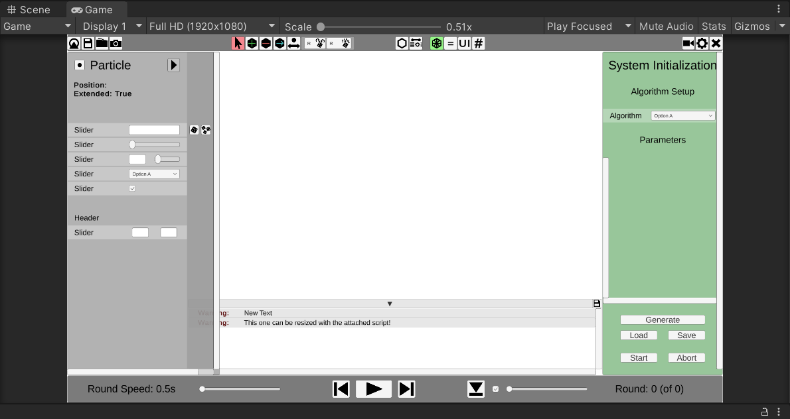

# Simulator Usage: Unity Editor Overview

Since AmoebotSim 2.0 is developed with Unity, you will need a basic understanding of the Unity Editor to use it.
There are much more in-depth tutorials on the [official Unity tutorial websites](https://learn.unity.com/tutorials), but the following short overview should suffice for most use cases.

## The Editor Interface

After opening the simulator project through Unity Hub, you should see the following window:

If your Editor looks different, use the dropdown menu in the top-right corner and select the "Default" layout.
You can resize and move the windows around to fit your needs

### Scene and Game View

This window displays either the *Scene View* or the *Game View*, depending on which tab is selected in the top-left corner of the window.

The *Scene View* shows the UI elements of the simulator as well as everything else that is visible in the application before it runs.
It is primarily used by developers who want to work on the simulation environment and is of little importance to the users of the simulator.

The *Game View* shows the graphical output of the simulator and allows the user to interact with the application's UI while it is running.
The window will automatically switch to the Game View when the Play button (directly above the window) is pressed.
The toolbar at the top of the Game View allows you to emulate a screen size and resolution other than that of your screen.
We recommend using the "Full HD (1920x1080)" setting to ensure that all UI elements are visible.

### Project Explorer and Console Window

This window displays a file explorer or a console window that lists log messages and exception notifications.
The Project window displays the content of the `Assets` folder by default.
For users, the `Assets/Code` folder is the most relevant.
Double-clicking on any C# file in this directory will open the file in your installed IDE.
